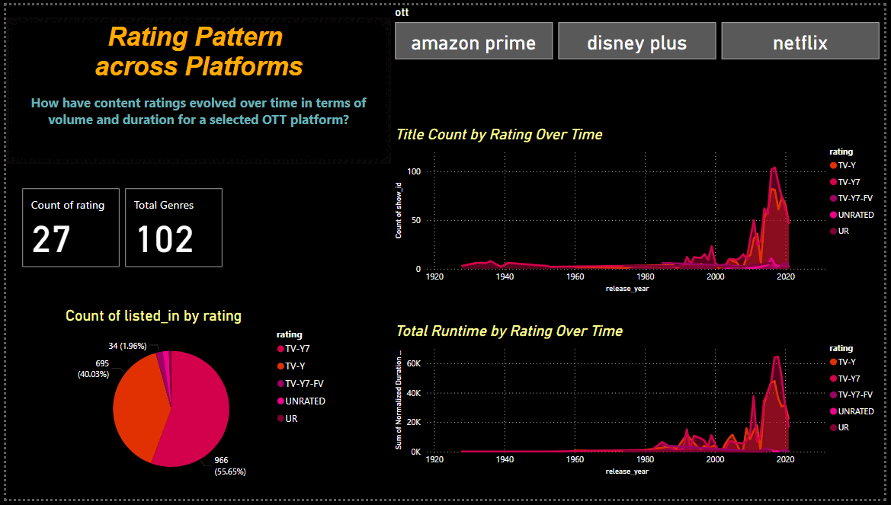

***

<h1 align="center">OTT Platform Analytics Dashboard</h1>

 This Power BI dashboard dissects a multi-platform OTT catalogue, revealing how movies and TV shows vary in volume, runtime, genre mix, ratings, and geographic origin over time. By consolidating key metrics such as title counts, normalized durations, content formats, and country contributions, it surfaces platform performance trends and content-creation patterns across the streaming landscape.

<h2>Key Features</h2>

  
- Compare movies vs. TV shows across platforms by count, duration, and variety
- Track how content volume and length evolved year over year
- Analyze content trends by country, platform, and format
- Explore genre and rating distributions with runtime insights
- Identify platform-specific content strategies and growth focus
- Spot the longest and shortest titles across OTT libraries
- Deep dive into content with dynamic drill-down (decomposition tree)

***

<h3 align="center"> Content Format Breakdown Across Platforms </h3>

This data-driven snapshot reveals how TV shows and movies compare across OTT platforms in terms of total title count, duration (in minutes), and content variety (genres). It reveals format dominance, platform focus, and distribution differences.

- Visualizes how OTT platforms differ in their focus on TV shows vs. movies</li>
- Highlights disparities in title count, total duration, and genre richness</li>
- Reveals platform content priorities and variety distribution across formats</li>

  <strong>Key Metrics by Format & Platform</strong> 
  

<h3 align="center">OTT Content Evolution & Extremes Over Time</h3>

This visual tracks the evolution of OTT content over the years across countries and platforms, highlighting changes in volume, duration, genre diversity, and audience ratings. It contrasts trends between TV shows and movies, showcasing shifts in platform strategies, viewer targeting, and notable extremes in runtimes.

- Tracks volume and duration trends across years, countries, and platforms</li>
- Highlights format-wise shifts in content strategies over time</li>
- Surfaces extreme runtimes with longest and shortest content ever released</li>

  <table>
    <tr>
      <td align="center" width="480">
        <strong>Key Metrics by Format & Platform</strong> 
        
      </td>
      <td align="center" width="480">
        <strong>Key Metrics by Format & Platform</strong> 
        
      </td>
    </tr>
  </table>

---

<h2 align="center">Platform & Format Trends</h2>

These graphics provide insights into a year-specific comparison of how OTT platforms differ in content strategy-highlighting the split between TV shows and movies in terms of both the number of titles and their total duration. The graphs reveal platform-wise preferences and content load distribution across formats.

- Year-specific comparison of content volume and duration by platform and format</li>
- Reveals platform content splits between movies and TV shows</li>
- Uncovers load distribution patterns and format focus across platforms</li>

  <table>
    <tr>
      <td align="center" width="480">
        <strong>OTT Platform Content Distribution</strong> 
        
      </td>
      <td align="center" width="480">
        <strong>Format-Wise Platform Comparison</strong> 
        
      </td>
    </tr>
  </table>

The data visualization outlines how OTT platforms prioritize content formats over time-uncovering strategic differences in the growth of movies vs. TV shows. By isolating either a format or platform, the comparison reveals evolving trends in volume and duration, reflecting each platform’s unique content trajectory.

- Visualizes platform-wise growth in series or movie output over time</li>
- Identifies changes in content duration and title count by platform or format</li>
- Highlights evolution of content preferences per platform strategy</li>

  <table>
    <tr>
      <td align="center" width="480">
        <strong>Platform Growth Over the Years</strong> 
        
      </td>
      <td align="center" width="480">
        <strong>Format Evolution Over the Years</strong> 
        
      </td>
    </tr>
  </table>

These visuals highlight the global distribution of content across countries, comparing how TV shows and movies are spread regionally for a selected platform or how various platforms perform within a chosen format. It reveals content concentration zones, regional preferences, and market reach across geographies.

- Compares TV/movie content distribution across countries for a selected platform</li>
- Analyzes which regions dominate specific formats or are underserved</li>
- Reveals market reach and regional focus of platforms via country-wise footprint</li>

  <table>
    <tr>
      <td align="center" width="480">
        <strong>Platform Spread Across Countries</strong> 
        
      </td>
      <td align="center" width="480">
        <strong>Format Distribution by Country</strong> 
        
      </td>
    </tr>
  </table>

<h3 align="center">Regional Patterns in OTT Content Production</h3>

These figures capture how content is distributed across countries for a selected OTT platform, showcasing both the number of titles and total duration. It helps identify major content-producing or hosting regions and the depth of content offered per country.

- Highlights country-wise title volume and duration for a selected platform</li>
- Identifies top content-producing countries across formats and genres</li>
- Compares depth of content contribution by region</li>

  <strong>Country-Wise Content Footprint</strong> 
  

  <table>
    <tr>
      <td align="center" width="480">
        <strong>Platform Spread Across Countries</strong> 
        
      </td>
      <td align="center" width="480">
        <strong>Format Distribution by Country</strong> 
        
      </td>
    </tr>
  </table>

---

<h2 align="center">Rating & Genre Trends</h2>

This section showcases how content ratings and genres have shifted across years on a selected OTT platform-both in terms of the number of titles released and the total duration offered. They reveal evolving viewer preferences and platform strategies in targeting content variety and maturity levels.

- Tracks year-wise shifts in content ratings and genres on a selected platform</li>
- Measures both title count and watch time offered in each category</li>
- Reveals platform strategies in genre diversification and maturity targeting</li>

  <table>
    <tr>
      <td align="center" width="480">
        <strong>Ratings Over Time</strong> 
        
      </td>
      <td align="center" width="480">
        <strong>Genre Diversity Trends</strong> 
        
      </td>
    </tr>
  </table>

This breakdown reveals how content ratings and genres have evolved over the years, highlighting changes in volume (number of titles) and duration (total minutes) across platforms and formats. Together, they showcase shifting audience preferences and how OTT platforms have adapted their content strategies accordingly.

- Compares how content ratings and genres evolved across platforms and formats</li>
- Highlights year-over-year changes in content mix and runtime</li>
- Exposes audience targeting shifts through volume-duration comparisons</li>

  <table>
    <tr>
      <td align="center" width="480">
        <strong>Rating Dynamics Across Time</strong> 
        
      </td>
      <td align="center" width="480">
        <strong>Genre Diversity Across Time</strong> 
        
      </td>
    </tr>
  </table>

The charts below demonstrate how content duration is distributed across genres and audience ratings, either platform-wise or by format. They uncover which genres dominate in watch time and how content length varies across maturity levels, helping identify strategic content focus areas.

- Shows how content duration is distributed across genres and rating categories</li>
- Identifies genres with highest watch time and maturity levels with longer content</li>
- Analyzes platform and format-specific differences in genre focus</li>

  <table>
    <tr>
      <td align="center" width="480">
        <strong>Content Duration by Genre & Rating</strong> 
        
      </td>
      <td align="center" width="480">
        <strong>Platform-wise Duration Insights</strong> 
        
      </td>
    </tr>
  </table>

---

<h2 align="center">Dynamic Exploration of Streaming Trends</h2>

The following analysis illustrates a hierarchical breakdown of OTT content across type, genre, and rating. It enables a structured exploration of content distribution strategies, revealing platform-specific patterns and notable titles within each category.

- Interactive drill-down analysis by content type, genre, and audience rating</li>
- Reveals detailed distribution logic behind platform content strategies</li>
- Highlights standout titles under each category path for deeper exploration</li>

  <table>
    <tr>
      <td align="center" width="480">
        
      </td>
      <td align="center" width="480">
        
      </td>
    </tr>
  </table>

***

This OTT Analytics Dashboard provides a comprehensive overview of content trends across major streaming platforms. By breaking down data by content type, genre, rating, country, and year, it uncovers meaningful insights into platform strategies, audience targeting, and evolving content patterns. From identifying peak content durations to comparing genre diversity and regional distributions, this analysis empowers stakeholders to make informed, data-driven decisions in the dynamic landscape of digital entertainment.

